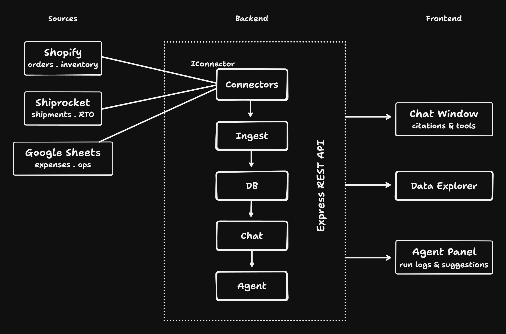

# D2C Agent

An AI agent for D2C brands. Connects to Shopify, Shiprocket, and Google Sheets, normalizes everything into a single data model, and gives founders a chat interface and an autonomous agent. Grounded in cited, traceable data.

## Live Link

The project is live on [https://d2c-agent-blush.vercel.app](https://d2c-agent-blush.vercel.app). The backend might take some time to load as it's the free tier on Render.

## 1. What I built



- A Node + TypeScript backend with three SaaS connectors behind one shared `IConnector` abstraction, all writing into a single `UniversalRecord` table in Postgres via Prisma ORM.

- A chat layer runs a GPT-4o tool-use loop. Every number in every response carries a citation back to the source row.

- An autonomous agent also runs GPT-4o, calls the same tools, identifies cost anomalies, and returns structured recommendations with savings figures computed deterministically from row data (not invented by the model).

- A React + Tailwind frontend surfaces the chat, agent run logs, and a raw data explorer.

- Every row is keyed by `merchantId`.

## 2. Connectors

**Shopify**: orders and inventory. Shopify is the revenue source of truth across most D2C brands. Order value is the denominator for every margin calculation downstream. Without it, nothing else is meaningful.

**Shiprocket**: shipments and logistics. This is where contribution margin erosion becomes visible. Brands track sales closely in Shopify, but logistics inefficiencies often go unmeasured. RTO rates, freight-to-order-value ratios, courier allocation issues, and volumetric weight overbilling directly impact profitability.

**Google Sheets**: expenses and ops. Most D2C teams have a sheet tracking ad spend, return processing costs, COGS, and warehouse fees. It's maintained manually in spreadsheets rather than structured systems. This data is essential because it completes the cost side of the margin equation.

These three together cover the full contribution margin picture:

> Revenue (Shopify) - Logistics Cost (Shiprocket) - Operational Cost (Sheets) = True Contribution Margin

## 3. Schema

```prisma
model UniversalRecord {
  id             String    @id @default(cuid())
  merchantId     String

  entityType     String       // order | shipment | inventory | expense | return
  source         String       // shopify | shiprocket | google_sheets
  sourceRecordId String       // original ID in the source system

  title          String?
  status         String?

  amount         Float?
  currency       String?

  timestamp      DateTime?
  metadata       Json         // normalized, source-agnostic fields
  rawPayload     Json         // original payload — never discarded

  createdAt      DateTime  @default(now())

  @@unique([source, sourceRecordId, merchantId])
  @@index([merchantId])
  @@index([merchantId, source])
  @@index([merchantId, entityType])
  @@index([merchantId, timestamp])
}
```

**Why this shape:**

`entityType` and `source` make the schema source-agnostic. Every row carries `sourceRecordId` and `source` so any number can be traced back.

`metadata` holds normalized fields (courier_name, shipping_city, etc.) that are meaningful across sources. `rawPayload` holds the original connector response untouched, this is the provenance contract. Every citation in the chat layer traces back to a row, and that row's `rawPayload` is the ground truth.

The `@@unique([source, sourceRecordId, merchantId])` constraint makes every ingest run idempotent. Re-running never duplicates rows.

All indexes are prefixed with `merchantId`. This is the sharding key. At 10k merchants, you can move to a partitioned table or a separate schema per merchant without changing any query logic, as the indexes already assume that pattern.

`amount` and `currency` are top-level denormalized fields so aggregate queries (`SUM(amount) WHERE source = 'shopify'`) don't require JSON extraction. Everything else lives in `metadata`.

## 4. Chat

**Tools Summary:**

| Tool              | Purpose                                                                                            |
| ----------------- | -------------------------------------------------------------------------------------------------- |
| `get_overview`    | Aggregated stats: revenue, shipping spend, expense breakdown. First call for any summary question. |
| `query_orders`    | Shopify orders with filters (status, date range). Returns citation-tagged rows.                    |
| `query_shipments` | Shiprocket shipments. Courier, freight, RTO status.                                                |
| `query_expenses`  | Google Sheets expenses. Filter by category (Marketing, Returns, COGS, Operations).                 |
| `cross_analysis`  | Joins all three sources, computes contribution margin for a date range.                            |
| `get_agent_runs`  | Returns recent agent run logs and recommendations.                                                 |

**Tool Schema:**

```json
[
  {
    type: "function",
    function: {
      name: "get_overview",
      description:
        "High-level stats: total orders, revenue, shipping spend, expense breakdown. Always call this first for any summary question.",
      parameters: { type: "object", properties: {} },
    },
  },
  {
    type: "function",
    function: {
      name: "query_orders",
      description:
        "Fetch Shopify orders from the unified store. Returns rows with citation IDs. Use for order counts, revenue, fulfillment status, and customer data.",
      parameters: {
        type: "object",
        properties: {
          status: {
            type: "string",
            description: "e.g. fulfilled, unfulfilled, cancelled",
          },
          date_from: {
            type: "string",
            description: "ISO date string e.g. 2026-05-01",
          },
          date_to: {
            type: "string",
            description: "ISO date string e.g. 2026-05-30",
          },
          limit: { type: "number" },
        },
      },
    },
  },
  {
    type: "function",
    function: {
      name: "query_shipments",
      description:
        "Fetch Shiprocket shipments. Use for shipping costs, courier breakdown, RTO analysis, delivery status.",
      parameters: {
        type: "object",
        properties: {
          status: {
            type: "string",
            description: "e.g. Delivered, RTO Initiated, In Transit",
          },
          date_from: { type: "string" },
          date_to: { type: "string" },
          limit: { type: "number" },
        },
      },
    },
  },
  {
    type: "function",
    function: {
      name: "query_expenses",
      description:
        "Fetch ops/expense data from Google Sheets. Covers marketing spend, return costs, COGS, warehouse fees.",
      parameters: {
        type: "object",
        properties: {
          category: {
            type: "string",
            description: "e.g. Marketing, Returns, COGS, Operations",
          },
          date_from: { type: "string" },
          date_to: { type: "string" },
          limit: { type: "number" },
        },
      },
    },
  },
  {
    type: "function",
    function: {
      name: "cross_analysis",
      description:
        'Joins Shopify revenue + Shiprocket shipping + Sheets expenses to compute contribution margin. Use for "how much did we actually make" questions.',
      parameters: {
        type: "object",
        properties: {
          date_from: { type: "string" },
          date_to: { type: "string" },
        },
      },
    },
  },
  {
    type: "function",
    function: {
      name: "get_agent_runs",
      description:
        "Retrieve AI agent run logs and recommendations. Use when asked about savings opportunities, courier recommendations, or agent findings.",
      parameters: {
        type: "object",
        properties: {
          limit: { type: "number" },
        },
      },
    },
  },
];
```

**How citation works:**

Every tool returns rows with a pre-built `citation` field: `[source:entityType:sourceRecordId]`. For example: `[shopify:order:SHPFY-1001]`, `[shiprocket:shipment:SR-004]`, `[google_sheets:expense:row_5]`.

The system prompt contains a hard contract: _"Every numerical claim MUST be followed by a citation. Never state a number without one. If you cannot cite it, do not state it."_

The frontend renders citation strings as inline colored tags: green for Shopify, orange for Shiprocket, blue for Sheets, so the user can see at a glance which source every number came from.

## 5. Agent

**What it does:**

Runs GPT-4o in a [ReAct loop](https://www.ibm.com/think/topics/react-agent) with access to the same six tools as the chat layer. The model decides which tools to call, in what order, based on a goal-directed system prompt: _"find the most impactful cost-saving opportunities."_ When it finishes calling tools, it outputs a structured JSON of `ProposedAction[]`.

**Hybrid design. Why:**

Initial versions let the model invent `estimated_savings_inr`. It hallucinated wildly — same data, different runs, ₹800 one time and ₹24,000 the next. The fix was a clean division of responsibility: the LLM identifies which rows are anomalous and classifies the type of saving (`pct_freight_reduction`, `rto_cost_avoidance`, `stockout_lost_revenue`). The code then computes the actual savings figure from the row data using deterministic arithmetic. The model reasons; the code calculates.

**Why this agent:**

Shipping cost is the highest-leverage, least-monitored cost for many D2C brands. Founders know their CAC and their AOV. They almost never know their freight-to-AOV ratio by courier, or which couriers are generating disproportionate RTO. This agent surfaces exactly that — and it needs cross-source data (Shiprocket freight + Shopify order value + Sheets return costs) that no single dashboard provides today.

**Trigger, data, decision, action:**

- **Trigger:** manual via API (`POST /agent/run`)
- **Data:** all three sources via tool calls, and the model decides what to pull
- **Decision:** GPT-4o reasoning over tool results, pattern identification
- **Action:** `ProposedAction[]` written to `AgentRun` table

## 6. Scale

**What works today:**

- `merchantId` on every row: data is logically sharded from day one
- Upsert-safe ingest via idempotency: re-running never corrupts data
- `IConnector` abstraction: connector logic is stateless, can run in any worker process
- All indexes prefixed with `merchantId`: ready for table partitioning

**What breaks first at 10k merchants:**

At small scale, parallel ingestion is manageable. At 10k merchants, however, the system becomes IO-bound:

- Shopify + Shiprocket APIs create large volumes of outbound HTTP requests
- Multiple concurrent ingest workers compete for Postgres connections
- Long-running syncs can starve newer jobs

**What I'd build to absorb it:**

To absorb it, we can build distributed ingestion queue using BullMQ backed by Redis. Each connector ingest will become a queue job with concurrency control, retries and backoff policies. Dedicated worker processes would then consume jobs independently. This changes the architecture from “many concurrent requests” to a controlled work-distribution system.

Above ~500 concurrent merchants, Postgres needs pgBouncer for connection pooling. The schema is already partitioning-ready. We will partition `UniversalRecord` by `merchantId` hash at ~5k merchants.

The chat and agent endpoints hit OpenAI per request with no rate limiting. At scale, add a per-merchant token bucket and a queue for agent runs **so a single large merchant doesn't exhaust the quota**.

## 7. Eval (where it breaks)

1. **Mock data only.** All three connectors return static fixtures written explicitly in their respective files.

2. **Citation contract is prompt-enforced, not code-enforced.** There is no post-processing step that rejects uncited numbers. A sufficiently confident model will occasionally drop a citation, especially on aggregated figures. A production system would parse the response and strip or flag any number not followed by a `[source:entity:id]` pattern.

3. **Cross-source join is fragile.** The Shiprocket↔Shopify link is `channel_order_id` matching Shopify's `sourceRecordId`. If a Shiprocket order is created manually outside the integration, it won't join to any Shopify order. The agent's freight-to-order-value analysis silently skips unmatched shipments.

4. **Single merchant hardcoded.** `MERCHANT_ID` is a single env var. Multi-tenancy requires auth middleware, per-request merchant resolution, and row-level security in Postgres. The data model supports it; the API does not.

5. **No rate limiting on `/chat` or `/agent/run`.** A single user can exhaust OpenAI quota. No token counting, no per-session limits.

## 8. Hours spent

Approximately 15 hours across 6 days.

- Day 1 (~3h)
- Day 2 (~2h)
- Day 3 (~2h)
- Day 4 (~2h)
- Day 5 (~2h)
- Day 6 (~4h)

## 9. What I'd do with another week

1. **Real connector implementations**: Implement connectors for Shopify, Shiprocket, Google Sheets that actually work with real data via real APIs. The mock data makes the architecture look right but isn't demonstrable end-to-end.
2. **BullMQ ingest queue**: Implement a proper job queue. This is the single biggest gap between "demo" and "production."
3. **Citation enforcement layer**: Post-process every chat response and strip uncited numbers before they reach the user. The contract should be code-enforced, not just prompt-enforced.
4. **Agent diff**: Only surface actions that are new or have worsened since the last run. Stops the agent from repeating the same recommendations forever.
5. **Auth + multi-tenancy**: JWT middleware, merchant resolution per request, Postgres RLS. The schema is ready, but not the API.

## AI tools

[Claude](https://claude.ai) was used throughout this build in the chatbot form, not as Claude Code. It helped in setting up the entire project (frontend + backend), generating types and interfaces, the chat tool-use loop, and large portions of the frontend components.
[ChatGPT](https://chatgpt.com) was used occasionally to enhance robustness of the programs, solve TypeScript errors and refine the frontend designs.

The following were designed and reasoned through by me, with AI used for implementation:

- The three connector choices and the reasoning behind them
- The `UniversalRecord` schema design and the decision to denormalize `amount`/`currency`
- The citation contract, the specific prompt language and the frontend rendering approach
- The hybrid agent architecture: the observation that the LLM was hallucinating savings figures, and the fix of having the model classify the action type while code computes the actual numbers
- The scale analysis and the specific breakage points

Roughly 85% of the code was AI-generated with my direction and review. 15% was written or significantly rewritten by hand, including this README.
